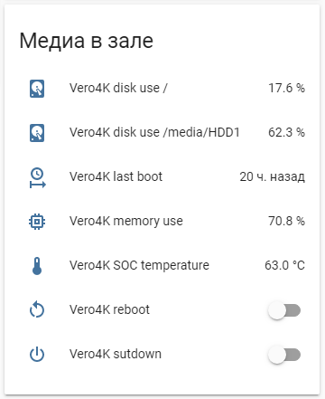

<h1>SysSensorsMQTT</h1>
<h3>DESCRIPTION</h3>

The MQTT client sends the following data to the MQTT broker with the specified frequency:

* SOC temperature;
* time of the last system startup;
* percentage of memory load;
* percent drive load.

The MQTT client also receive reboot command, that reboot system. 

When the client is turned on, if it does not detect the MQTT broker at the specified address,
the client continues to try connect every minute.

The client log is in the "log_file" path (see settings.yaml). Logs has rotation (max 1 MB, 1 back file)

Tested only on Vero 4K and Banana Pi M1+.

<h3>INSTALLATION</h3>

* Install pip:
  * sudo apt-get install python3-pip

* Install additional packages:
  * sudo apt-get install gcc python3-dev (maybe build-essential)
  * sudo pip3 install setuptools

* Copy client files to the desired path, for example, /home/osmc/SysSensorsMQTT
* Go to the created path:
  * cd /home/osmc/SysSensorsMQTT
  * sudo pip3 install -r requirements.txt
* Set the necessary settings in the settings.yaml file:
  * nano settings.yaml
  
  Parameter | Default | Description
  --------- | ------- | -----------
  mqtt: |    | 
   - hostname | 127.0.0.1 | path to MQTT broker
   - port | 1883 | MQTT broker port
   - user | | User name to connecto to MQTT broker
   - password | | Password to connecto to MQTT broker
  device_name | device | Device name (any)
  client_id | client1 | MQTT client ID (any)
  timezone | Europe/Moscow | Time zone (see [list of pytz time zones](https://gist.github.com/heyalexej/8bf688fd67d7199be4a1682b3eec7568)
  update_interval | 300 | Sensors update time interval (integer)
  manufacturer | manufacturer | Device manufacturer (any)
  model | model | Device model (any)
  logging_level | INFO | Log level: INFO, DEBUG, ERROR
  reboot/shutdown | False | Subscribe to reboot and shutdown topics? True/False
  log_file | /var/log/sys_sensors_mqtt.log | Path to log file (full or relative)
  homeassistant | False | Transfer configuration to topic "homeassistant"? True/False
  topic | devices | Topic to publish state
  
* Edit the sys_sensors_mqtt.service file:
  * nano sys_sensors_mqtt.service
  * set in the line "WorkingDirectory=/home/osmc/SysSensorsMQTT" the correct path to the newly copied files
  * do the same in the line "ExecStart=/home/osmc/SysSensorsMQTT/sys_sensors_mqtt_daemon.py", leave /sys_sensors_mqtt_daemon.py

* Transfer the service file to the UNIX system (just in case):
  * sudo dos2unix sys_sensors_mqtt_daemon.py

* Make the service file executable:
  * sudo chmod u+x sys_sensors_mqtt_daemon.py

* Enable service:
  * sudo cp sys_sensors_mqtt.service /etc/systemd/system
  * sudo systemctl daemon-reload
  * sudo systemctl enable sys_sensors_mqtt
  * sudo systemctl start sys_sensors_mqtt

You can turn off the service with the command: sudo systemctl stop sys_sensors_mqtt

You can restart the service with the command: sudo systemctl restart sys_sensors_mqtt

Based on https://github.com/Sennevds/system_sensors
